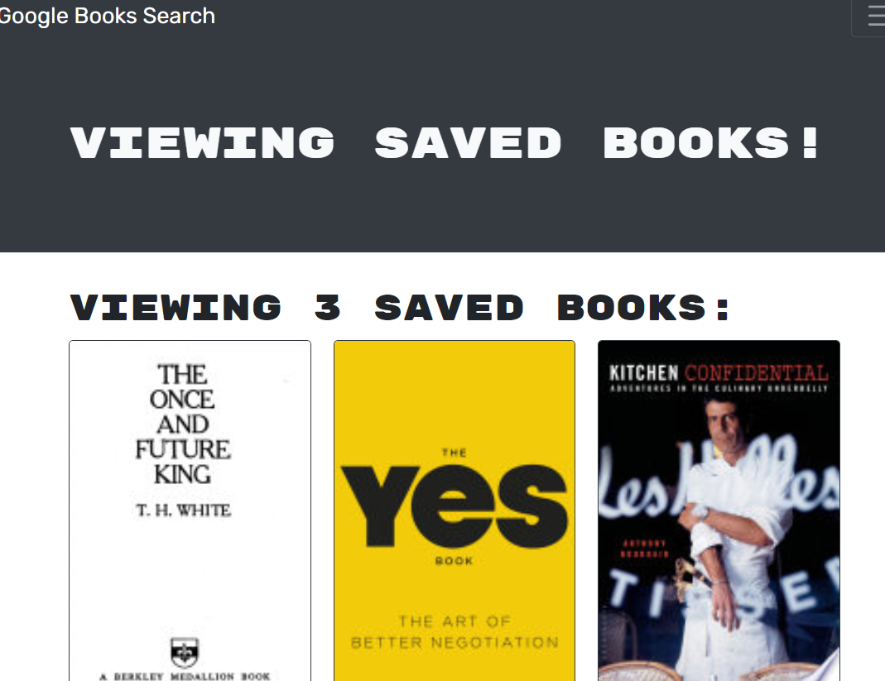

# Book Searcg Engine
    
  ## Table of Contents
  - [Description](#description)
  - [Link](#link)
  - [Image](#image)
  - [Questions](#questions)
    
  ## Description
  This fully functional website ran on express server and RESTful API and I refectored it to be a GraphQL API that uses Apollo Server. The idea here was to keep all the functionality of a complete project and convert it to an entirely different backend. I used Apollo Server to handle the interactions with my MongoDB database and the routing through a React platform. The original Google Books API is still used for the fetching of outside data. After converting the RESTful API backend I also refactored the logic in the frontend to handle the changes.
    
  ## Link
  
  [Live Page]( https://radiant-spire-43837.herokuapp.com/)
    
  ## Image
  
  
    
  ## Questions
  If you need any more information on using this application, my email is simplererstone@gmail.com.
  My GitHub profile can be located here - >  [Simplerer](https://github.com/Simplerer)  < -